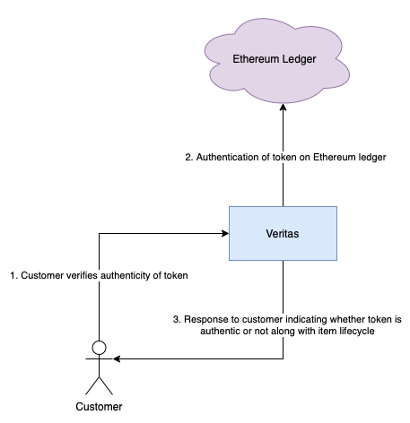

# Veritas - Decentralized Authentication System

## Proposal

### Introduction

[Industries are currently losing billions of dollars owing to counterfeits present on the market](https://www.oecd.org/sti/ind/2090589.pdf). An application that allows users to determine the authenticity of a product before purchasing it can help curb this issue.

### Abstract

[The blockchain is starting to be used by companies to provide visibility in their supply chain and supply cycle of the product](https://consensys.net/blockchain-use-cases/supply-chain-management/). However, the problem of guaranteeing authenticity to the consumer still remains a challenge.

Companies can associate tokens on the blockchain for each stock keeping unit (SKU) and during the sale to the customer they can provide it to the customer via email or through a QR code that the customer can scan. This QR code can also be scanned by the customer to ensure that the product is authentic before buying it - the application would only verify tokens that exist on the blockchain and let the user know about the history of the product and its authenticity.

Blockchain can prove to be really valuable here due to it being tamper-proof. It can allow companies to provide full transparency to the product and its life cycle.

### Approach

We will create a web app that companies can use to associate its products with and generate tokens on the [Ethereum ledger](https://ethereum.org/en/) along with associate QR codes that they can print on their products. The application can also be extended to allow companies to track the product life cycle on the blockchain.

A customer facing mobile application will also be developed that would allow customers to scan QR codes and verify the authenticity of a product while also getting all the product life cycle information available.

Development of such an application would require frequent experimentation, and we plan to go about that by deploying our own [private Ethereum blockchain network on AWS](https://aws.amazon.com/blogs/database/deploy-smart-contracts-to-your-private-ethereum-blockchain-network-on-aws/).

### Persona

Companies trying to prevent counterfeits and users purchasing such products

## Architecture

The following flows describe the high level architecture of Veritas

### Store registers item with Veritas

The first part of the system flow begins with stores regisering their products with Veritas. Doing so allows the stores to associate their products with a unique token on the blockchain (Ethereum ledger). This token is meant to be paired with the item and basically acts as a digital certificate of authenticity.

### Customer purchases item

When a customer purchases the item, they will have the token transferred to them by the store as a proof of authenticity.

### Customer verifies authenticity of item

The customer can verify the authenticity of the item/token they received by checking in with the Veritas application. The Veritas application will check the token on the blockchain and return the product history and the authenticity of the product.

### Customer sells the item (2nd sale)

When the customer wants to sell the item to another person (such as someone reselling sneakers), they can transfer the token to the new owner (the buyer can verify the authenticity of the item using the token). This way each item is associated with a single unique token that is transferred from owner to owner, thus curbing counterfeits.

## Setup

### Requirements

- `npm install -g ganache-cli truffle` (for local development)
- `pip3 install -r requirements.txt`

### Deploying Veritas Locally

- Run `ganache-cli`
- Run `truffle migrate` in the root directory
  - This will deploy the smart contracts in the local instance of Ethereum we spin up using `ganache-cli`
- Run `solc --combined-json abi,asm,ast,bin,bin-runtime,devdoc,function-debug,function-debug-runtime,generated-sources,generated-sources-runtime,hashes,metadata,opcodes,srcmap,srcmap-runtime,storage-layout,userdoc -o . veritas.sol` from the .
  - This requires the `solc` Solidity compiler to be installed on your machine
